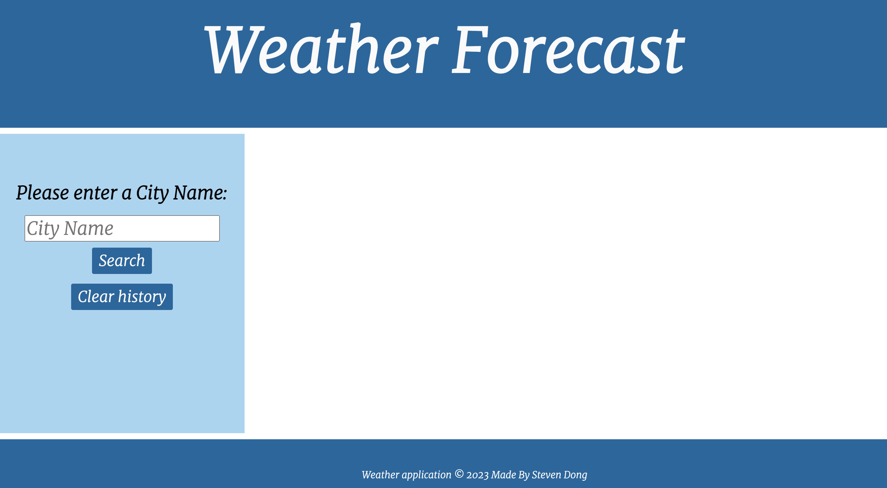

# weather forecast app 

## Description

This app allows users to get the weather information (in metrics format) by entering a city name, and the dashboard will display the current weather infomation (date, weather icon, degree, wind speed and humidity) as well as the forecast for the next five days. 

This app also allows the user to check the weather forecast from their previous search input, for example, I looked up Melbourne's weather then looked up New York; I then want to revisit the forecast for Melbourne, I can simply by clicking on to the city name then it would display the weather information on the dashborard without retyping it in the search bar. 

## Installation

Deployed app: https://stevendong2512.github.io/weather/

VS code, live server JavaScript, jQuery, dayJS, bootstrap and openweather api. 

## Usage
Overview of the user interface at the start page: 

After user has put in the first city name then search:

After user has put in the second city name then search, the history section is displying both city input as buttons for user to reference in the future:

When clicked on the generated button, user will then be directed back to the weather forecast for according city:

When the clear history button is clicked, the search history will be cleared out from the search history so will the city buttons: 

## Credits

Steven Dong

## License

MIT License

Copyright (c) 2023 StevenDong2512

Permission is hereby granted, free of charge, to any person obtaining a copy
of this software and associated documentation files (the "Software"), to deal
in the Software without restriction, including without limitation the rights
to use, copy, modify, merge, publish, distribute, sublicense, and/or sell
copies of the Software, and to permit persons to whom the Software is
furnished to do so, subject to the following conditions:

The above copyright notice and this permission notice shall be included in all
copies or substantial portions of the Software.

THE SOFTWARE IS PROVIDED "AS IS", WITHOUT WARRANTY OF ANY KIND, EXPRESS OR
IMPLIED, INCLUDING BUT NOT LIMITED TO THE WARRANTIES OF MERCHANTABILITY,
FITNESS FOR A PARTICULAR PURPOSE AND NONINFRINGEMENT. IN NO EVENT SHALL THE
AUTHORS OR COPYRIGHT HOLDERS BE LIABLE FOR ANY CLAIM, DAMAGES OR OTHER
LIABILITY, WHETHER IN AN ACTION OF CONTRACT, TORT OR OTHERWISE, ARISING FROM,
OUT OF OR IN CONNECTION WITH THE SOFTWARE OR THE USE OR OTHER DEALINGS IN THE
SOFTWARE.
